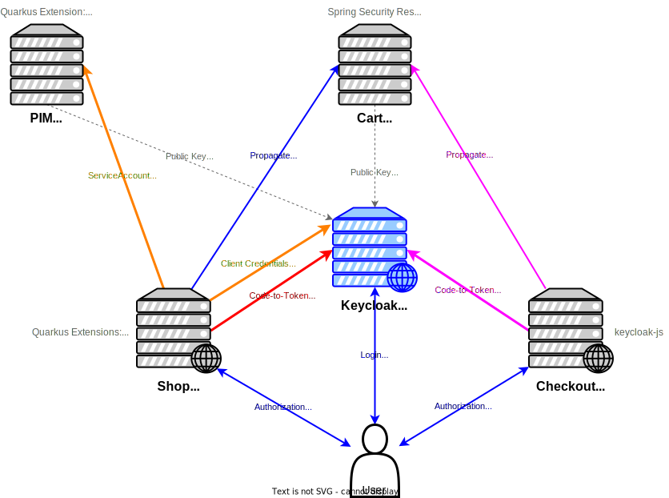

= Keycloak Bookshop Demo

Demo application landscape to show various and different kinds of user- and client authentication with Keycloak in a distributed environment with web applications and services.

== Description and Use Case

It's kind of a web shop, selling books.

Users can access the `shop` and the `checkout`, both are web apps.
They have to authenticate themselves using their credentials with Keycloak and web apps using the _Authorization Code Flow_ to get the users access token via code-to-token exchange from the Keycloak server (using backchannel in `shop` app).
The `shop` is a _Quarkus_ based application, using _Quarkus Extensions_, the `checkout` is a _React.JS_ based application, using the _keycloak-js JavaScript Adapter_.

The `shop` gets its products from the `pim` (product information management) service, also a Quarkus based service, dealing with BearerOnly token validation.

The `cart` service (Quarkus based) stores the products a user wants to "buy".
So, it has to be accessed in the context of the user, but users can't access it directly, that's why the web apps (both, `shop` _and_ `checkout`) have to _propagate_ the users access token to the `cart`.

== Architectural Overview

== Docker Image

There is a public Docker image available with this distributed bookshop example.
Simply pull the image from the official Docker Hub:

  $ docker pull dasniko/bookshop:latest

The configuration of the apps and services in the Docker image is aligned with the link:./bookshop-realm.json[`bookshop-realm.json`] realm JSON export available here in the repository root.

The apps and services expect Keycloak to be available under hostname/port `http://keycloak:8080`.
